# Artboards

This is an autogenerated file showing all the artboards. Do not edit it directly.

## 0.Login

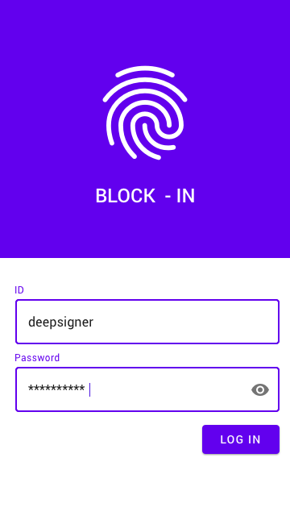

## 1-1.Link Click

## 1.My page

## 2.Join a Contract

## 3. Before Confriming

## 3. Selecting Device

## 4. Confirmed

## 512X512

## 6. Ongoing

## 7.Dialog

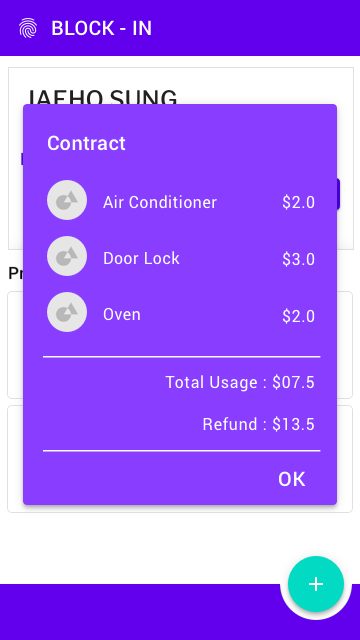

## 8.Final

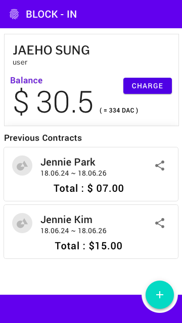

## App Bar 

## Artboard 4

## Backdrop 

## Backdrop

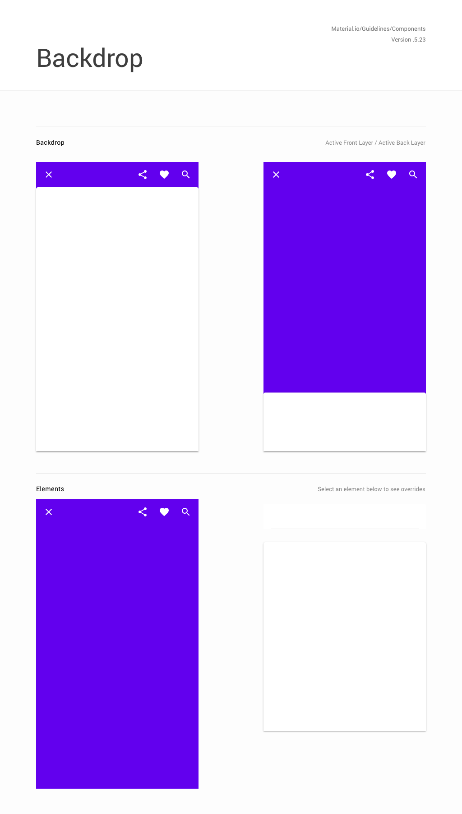

## Banner 

## Banners

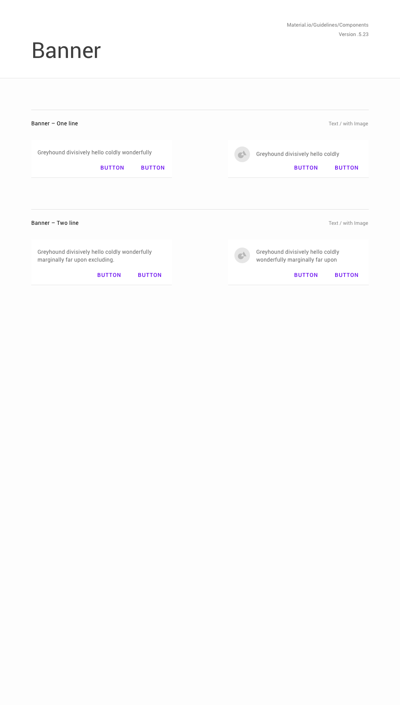

## Bottom App Bars

## Bottom Navigation 

## Bottom Navigation

## Buttons 

## Buttons

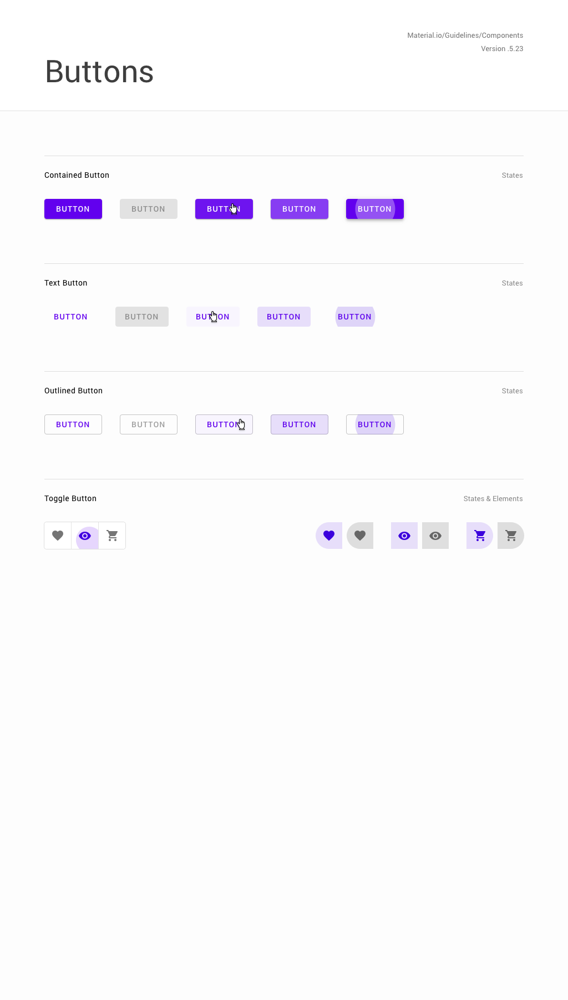

## Cards 

## Chips 

## Color Scheme

## Dialogs 

## Dialogs

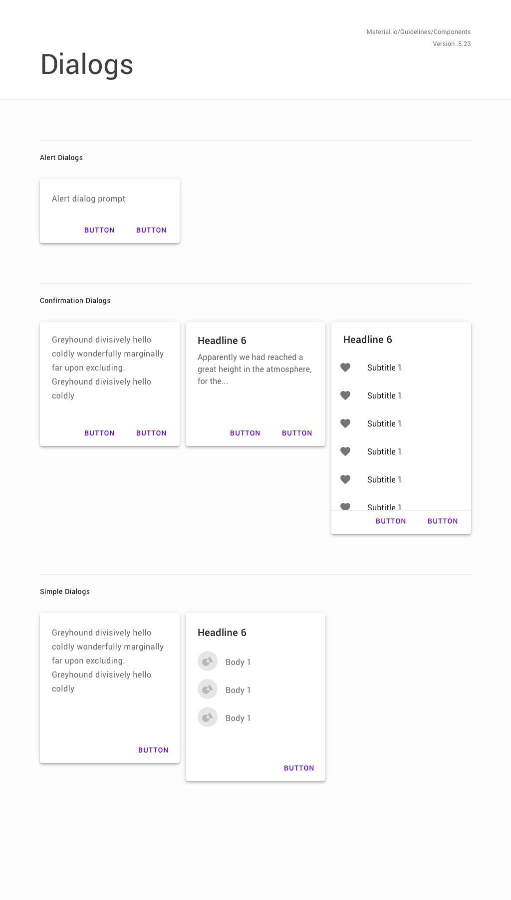

## Divider 

## Elevation

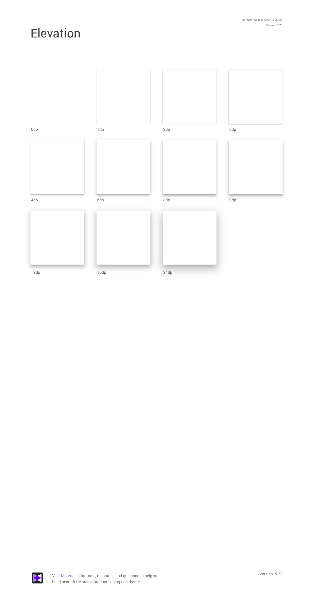

## FAB 

## FAB

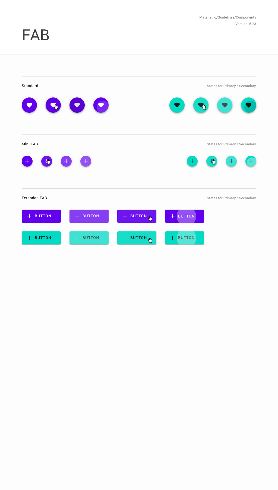

## Getting Started

## Icon 

## Icon Grids 

## Image Lists 

## Image Treatments 

## Images 

## Keyboard

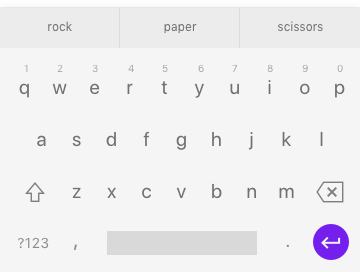

## Library Preview

## List 

## Menu 

## Menus

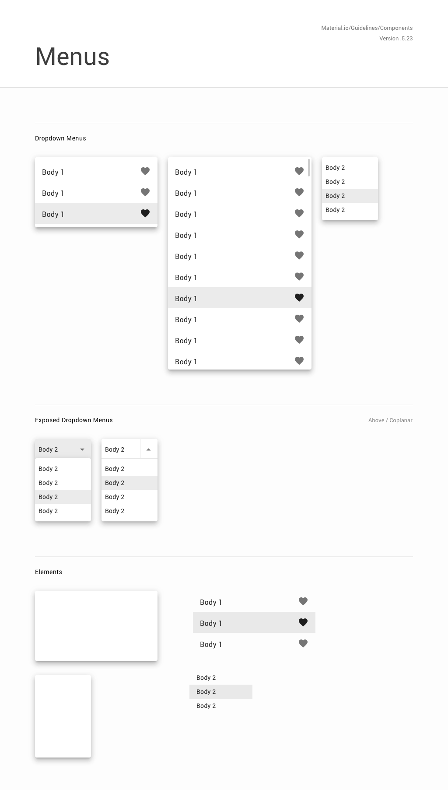

## Navigation Drawer 

## Product Icons

## Progress Indicators 

## Progress Indicators

## Scrollbar 

## Selection Control 

## Selection Controls

## Shadow 

## Sheets 

## Slider 

## Sliders

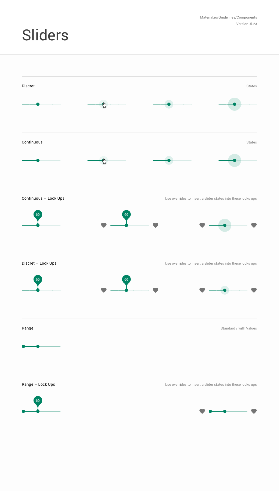

## Snackbar 

## Snackbar & Banner

## System Bar 

## System Icons

## Tab 

## Tabs

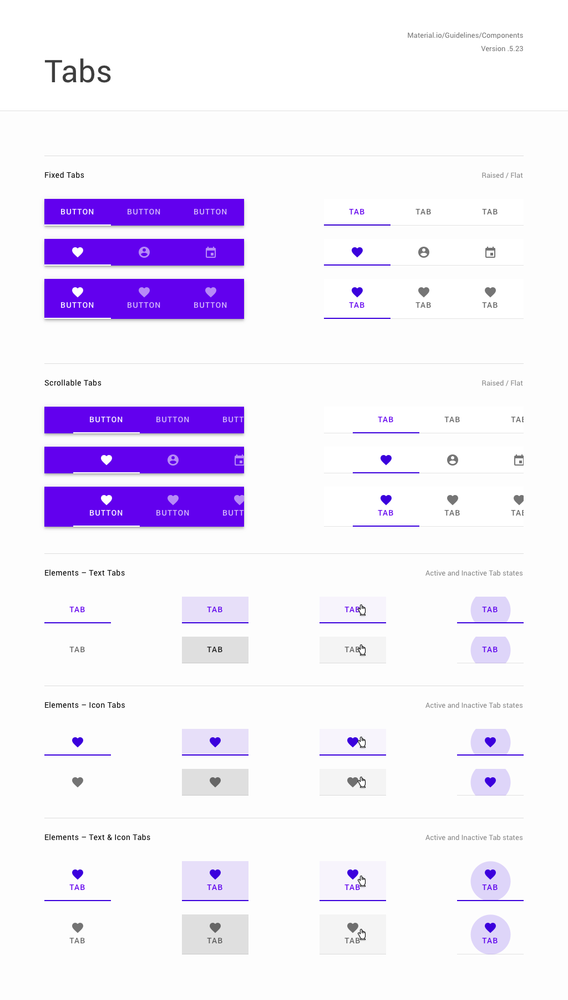

## Text Field 

## Theme UI

## Tooltip

## Tooltips

## Top App Bars

## Typography Scale

## favicon

## svg

## x. useless

## ✱ 

